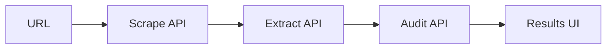

# Website Audit Tool

AI-assisted **single-page** audit for marketing sites: factual metrics extracted from HTML, then **Gemini** produces structured insights and prioritized recommendations. Scope: **one URL per run**, no multi-page crawling.

**Assignment / grader checklist:** [SUBMISSION.md](./SUBMISSION.md) (repo link, deployed URL, prompt logs).

## Live demo

Add your deployed URL here after publishing (e.g. Vercel):

- **Production:** `https://YOUR_DEPLOYMENT.vercel.app` *(replace when deployed)*

Local: [http://localhost:3000](http://localhost:3000)

## Setup

**Requirements:** Node.js 18+, npm.

```bash
npm install
cp .env.example .env.local   # if you add an example file; otherwise create .env.local manually
```

Create **`.env.local`** in the project root:

| Variable | Required | Description |
|----------|----------|-------------|
| `FIRECRAWL_API_KEY` | Yes | [Firecrawl](https://firecrawl.dev): fetches page HTML + markdown for the URL. |
| `GEMINI_API_KEY` | Yes* | [Google AI Studio](https://aistudio.google.com/apikey): powers structured JSON audit. |
| `GEMINI_MODEL` | No | Defaults to `gemini-2.5-flash`. Override if your project has quota on another model ID. |
| `MOCK_AUDIT` | No | Set to `true` to skip Gemini and use deterministic mock insights (uses real metrics). |

\*If `GEMINI_API_KEY` is unset, the app uses **mock audit** mode so the UI still works for demos.

```bash
npm run dev
```

Open `/`, enter a full `https://` URL, then review results (metrics to AI insights to prompt log).

**Build for production:**

```bash
npm run build
npm start
```

## Architecture overview

```
Browser
  → POST /api/scrape   (Firecrawl: HTML + markdown + metadata)
  → POST /api/extract  (Cheerio: PageMetrics from HTML + metadata fallback)
  → POST /api/audit    (Gemini: JSON insights + recommendations; or mock)
```

- **Scraping** (`lib/firecrawl.ts`) is isolated from **metrics** (`lib/metrics.ts`) and **AI** (`lib/audit.ts`, `lib/prompts.ts`).
- **Factual data** is typed as `PageMetrics` and passed to the model as JSON plus truncated markdown (`lib/prompts.ts`).
- **AI output** is validated with `parseInsightsJson` (schema + **3-5** recommendations) before the client sees it.
- **Prompt logs** (`PromptLog`) store system prompt, user prompt, raw model output, token counts, and timestamp, and are exposed in the UI and downloadable as JSON.



## AI design decisions

1. **Single structured response:** One Gemini call returns JSON matching `AuditInsights` (SEO, messaging, CTA, UX, content depth + recommendations). This keeps orchestration simple and matches the assignment's "structured outputs" expectation.
2. **Grounding:** The system prompt forbids inventing metrics; the user prompt embeds `JSON.stringify(metrics)` and page markdown so scores and issues can cite real numbers.
3. **Recommendation shape:** Each item includes `metric_reference`, `effort`, `impact`, and `priority` so outputs are actionable for an agency workflow.
4. **Validation:** Server-side parsing rejects invalid JSON and enforces **3-5** recommendations so the UI never shows a half-formed contract.
5. **Retries:** Transient Gemini errors (429/503/500) retry with backoff and API retry hints (`lib/audit.ts`).
6. **Mock mode:** Without an API key, `getMockAuditResponse` still cites real `PageMetrics` so evaluators can test the pipeline without keys.

## Trade-offs

| Choice | Benefit | Cost |
|--------|---------|------|
| Firecrawl for fetch | Reliable HTML/markdown, handles edge sites | External dependency + API key |
| Cheerio server-side | Fast, deterministic metrics | Heuristic CTA detection (keyword patterns on `button`/`a`), not visual "primary button" ML |
| One LLM call | Low latency and cost | No multi-step critique or tool use |
| Markdown truncated (~24k chars) | Stays within token limits | Very long pages lose tail content in the prompt |
| Next.js App Router API routes | Simple deployment story | Cold starts on serverless hosts |

## Prompt logs (deliverable)

The results page includes a **Prompt log** drawer with:

- System prompt  
- User prompt (metrics JSON + markdown)  
- Raw model output  
- Model id, input/output token counts, timestamp  
- **Download JSON** (prompt log only) for submission or redaction of secrets  

## Export

After a successful run, the results page offers **Download JSON** and **Download Markdown** for the **full report**: audited URL, optional crawl metadata (title, description, status), factual metrics, AI insights and recommendations, and the complete prompt log. Files are named like `website-audit-example.com-2026-03-29.json` / `.md`. Page HTML and markdown are not included to keep files small.

## What we would improve with more time

- **Smarter CTAs:** Classify primary vs secondary actions (e.g. main nav vs footer) using DOM position or design-system hooks.
- **Structured retries on schema failure:** If Gemini returns JSON with fewer than three recommendations, optionally re-prompt with a repair instruction instead of failing.
- **Caching:** Cache scrape + metrics by URL for a short TTL to save API quota during repeated audits.
- **Accessibility:** Beyond alt %: contrast checks or heading order warnings using dedicated rules.
- **Deploy:** CI build, environment-specific keys, and rate limiting on `/api/*`.

## Tech stack

Next.js 16 (App Router), React 19, Tailwind CSS, Firecrawl, Cheerio, `@google/generative-ai`, TypeScript.

## Scripts

| Command | Description |
|---------|-------------|
| `npm run dev` | Dev server |
| `npm run build` | Production build |
| `npm start` | Run production server |
| `npm run lint` | ESLint |

## License

Private / assignment use unless otherwise specified.
